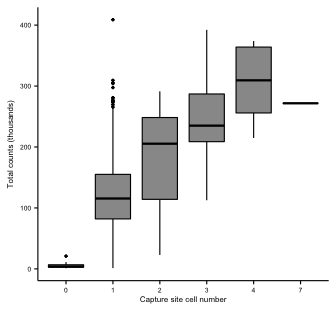
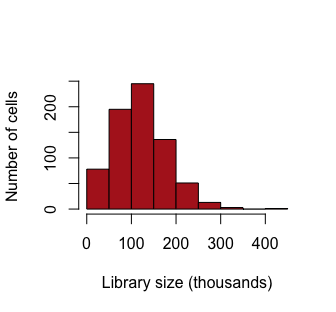
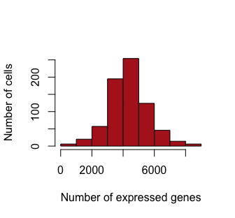
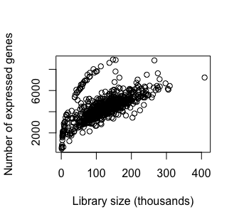
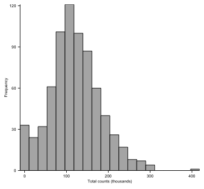
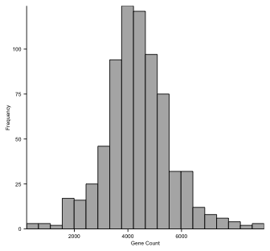
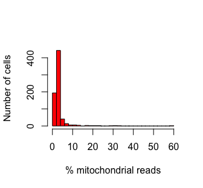
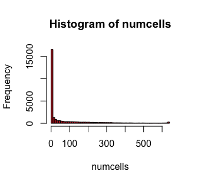

scRNA-Seq Anlaysis - 02 - Filtering
================

-   [Dependencies](#dependencies)
-   [Load the data](#load-the-data)
-   [Filtering](#filtering)
    -   [Empty or multiplet-containing Fluidigm C1 capture sites](#empty-or-multiplet-containing-fluidigm-c1-capture-sites)
    -   [Library size and gene detection](#library-size-and-gene-detection)
        -   [Distribution of library size and feature number](#distribution-of-library-size-and-feature-number)
    -   [Mitochondrial proportion](#mitochondrial-proportion)
    -   [Feature filtering](#feature-filtering)
-   [Save Point](#save-point)

Dependencies
============

``` r
library(scater)
```

    ## Loading required package: Biobase

    ## Loading required package: BiocGenerics

    ## Loading required package: parallel

    ## 
    ## Attaching package: 'BiocGenerics'

    ## The following objects are masked from 'package:parallel':
    ## 
    ##     clusterApply, clusterApplyLB, clusterCall, clusterEvalQ,
    ##     clusterExport, clusterMap, parApply, parCapply, parLapply,
    ##     parLapplyLB, parRapply, parSapply, parSapplyLB

    ## The following objects are masked from 'package:stats':
    ## 
    ##     IQR, mad, sd, var, xtabs

    ## The following objects are masked from 'package:base':
    ## 
    ##     anyDuplicated, append, as.data.frame, cbind, colMeans,
    ##     colnames, colSums, do.call, duplicated, eval, evalq, Filter,
    ##     Find, get, grep, grepl, intersect, is.unsorted, lapply,
    ##     lengths, Map, mapply, match, mget, order, paste, pmax,
    ##     pmax.int, pmin, pmin.int, Position, rank, rbind, Reduce,
    ##     rowMeans, rownames, rowSums, sapply, setdiff, sort, table,
    ##     tapply, union, unique, unsplit, which, which.max, which.min

    ## Welcome to Bioconductor
    ## 
    ##     Vignettes contain introductory material; view with
    ##     'browseVignettes()'. To cite Bioconductor, see
    ##     'citation("Biobase")', and for packages 'citation("pkgname")'.

    ## Loading required package: ggplot2

    ## Loading required package: SingleCellExperiment

    ## Loading required package: SummarizedExperiment

    ## Loading required package: GenomicRanges

    ## Loading required package: stats4

    ## Loading required package: S4Vectors

    ## 
    ## Attaching package: 'S4Vectors'

    ## The following object is masked from 'package:base':
    ## 
    ##     expand.grid

    ## Loading required package: IRanges

    ## Loading required package: GenomeInfoDb

    ## Loading required package: DelayedArray

    ## Loading required package: matrixStats

    ## 
    ## Attaching package: 'matrixStats'

    ## The following objects are masked from 'package:Biobase':
    ## 
    ##     anyMissing, rowMedians

    ## 
    ## Attaching package: 'DelayedArray'

    ## The following objects are masked from 'package:matrixStats':
    ## 
    ##     colMaxs, colMins, colRanges, rowMaxs, rowMins, rowRanges

    ## The following object is masked from 'package:base':
    ## 
    ##     apply

    ## 
    ## Attaching package: 'scater'

    ## The following object is masked from 'package:S4Vectors':
    ## 
    ##     rename

    ## The following object is masked from 'package:stats':
    ## 
    ##     filter

``` r
library(ggplot2)
```

Load the data
=============

``` r
sce <- readRDS("../output/sce.processed.rds")
```

Filtering
=========

Empty or multiplet-containing Fluidigm C1 capture sites
-------------------------------------------------------

During the protocol, we had visually inspected all 800 capture sites and made note of the number of captured cells. It's best to remove apture cells with 0 or multiple cells

``` r
multi.plot <- ggplot(as.data.frame(colData(sce)), aes(x=as.factor(CellNumber), y=total_counts/1000)) +
  geom_boxplot(color="black", fill="grey60", size=0.4, outlier.size=0.5) +
  xlab("Capture site cell number") + ylab("Total counts (thousands)") +
  theme_classic() +
  theme(axis.text = element_text(size=5, color="black"),
        axis.title.x = element_text(size=6, color="black", margin=unit(c(1,0,0,0), "mm")),
        axis.title.y = element_text(size=6, color="black", margin=unit(c(0,1,0,0), "mm")),
        axis.line = element_line(size=0.4, color="black"),
        axis.ticks = element_line(size=0.4, color="black"),
        plot.background=element_rect(fill="transparent", colour=NA))
multi.plot
```



``` r
ggsave(multi.plot, file="../figs/capture.site.cell.counts.pdf", width=2.6, height=1.75,
       useDingbats=F)
```

And remove all but singlets

``` r
sce <- scater::filter(sce, CellNumber == 1)
nrow(colData(sce))
```

    ## [1] 722

Library size and gene detection
-------------------------------

Poor quality reactions/cells can be predicted by low counts/gene detection. Multiplets that we missed in our annotation may appear as libraries with an abnormally high number of reads/genes detected. By filtering outliers in either direction, we can try to avoid their impact on downstream analysis.

``` r
hist(sce$total_counts/1e3, xlab="Library size (thousands)", 
     ylab="Number of cells",main="", col="Firebrick")
```



``` r
hist(sce$total_features, xlab="Number of expressed genes", 
     ylab="Number of cells", main="", col="Firebrick")
```



``` r
plot(x=sce$total_counts/1e3, y=sce$total_features, xlab="Library size (thousands)",
     ylab="Number of expressed genes", main="")
```



We'll set thresholds for cells with &gt;20K reads but less than 250K (perhaps multiplets that we didn't catch), and within 3 median absolute deviations away from the median number of detected genes

``` r
libsize.drop <- sce$total_counts < 20000 | sce$total_counts > 250000
feature.drop <- isOutlier(sce$total_features, nmads=3, type="both", log=F)
```

### Distribution of library size and feature number

``` r
library.plot <- ggplot(as.data.frame(colData(sce)), aes(x=total_counts/1000)) +
  geom_histogram(color="black", fill="grey70", size=0.3, stat="bin", bins=20) +
  scale_x_continuous(expand=c(0,0)) + scale_y_continuous(expand=c(0,0)) +
  xlab("Total counts (thousands)") + ylab("Frequency") +
  theme_classic() +
  theme(axis.text = element_text(size=5, color="black"),
        axis.title.x = element_text(size=5, color="black", 
                                    margin=unit(c(1,0,0,0), "mm")),
        axis.title.y = element_text(size=5, color="black", 
                                    margin=unit(c(0,0,0,0), "mm")),
        axis.line = element_line(size=0.3, color="black"),
        axis.ticks = element_line(size=0.3, color="black"),
        plot.background=element_rect(fill="transparent", colour=NA))
library.plot
```



``` r
ggsave(library.plot, file="../figs/count.distribution.pdf", width=1.1, height=0.9,
       useDingbats=F)

feature.plot <- ggplot(as.data.frame(colData(sce)), aes(x=total_features)) +
  geom_histogram(color="black", fill="grey70", size=0.3, stat="bin", bins=20) +
  scale_x_continuous(expand=c(0,0), breaks=c(2000, 4000, 6000)) + 
  scale_y_continuous(expand=c(0,0)) +
  xlab("Gene Count") + ylab("Frequency") +
  theme_classic() +
  theme(axis.text = element_text(size=5, color="black"),
        axis.title.x = element_text(size=5, color="black", 
                                    margin=unit(c(1,0,0,0), "mm")),
        axis.title.y = element_text(size=5, color="black", 
                                    margin=unit(c(0,0,0,0), "mm")),
        axis.line = element_line(size=0.3, color="black"),
        axis.ticks = element_line(size=0.3, color="black"),
        plot.background=element_rect(fill="transparent", colour=NA))
feature.plot
```



``` r
ggsave(feature.plot, file="../figs/feature.distribution.pdf", width=1.1, height=0.9,
       useDingbats=F)
```

Mitochondrial proportion
------------------------

A high proportion of mitochrondial reads can be indicative of poor-quality libraries, so it's best to remove them.

``` r
hist(sce$pct_counts_Mt, 
     xlab="% mitochondrial reads",
     ylab="Number of cells", breaks=25, main="", col="red")
```



``` r
mito.drop <- isOutlier(sce$pct_counts_Mt, nmads=3, type="higher", log=T)
sce <- sce[,!(libsize.drop | feature.drop | mito.drop)]
data.frame(ByLibSize=sum(libsize.drop), ByFeature=sum(feature.drop), 
           ByMito=sum(mito.drop), Remaining=ncol(sce))
```

    ##   ByLibSize ByFeature ByMito Remaining
    ## 1        62        18     35       640

Feature filtering
-----------------

The most obvious thing to filter out is genes with no counts across all cells. We'll require each gene to be detected in a minimum of 10 cells

``` r
numcells <- nexprs(sce, byrow=TRUE)
keep <- numcells >= 10 
sum(keep)
```

    ## [1] 14327

``` r
hist(numcells, breaks=50, col="firebrick")
```



``` r
sce <- sce[keep,]
```

Save Point
==========

``` r
saveRDS(sce, file="../output/sce.filtered.rds")
```
