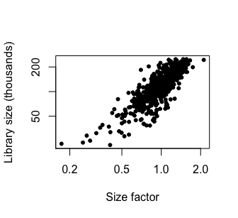
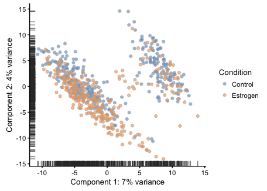
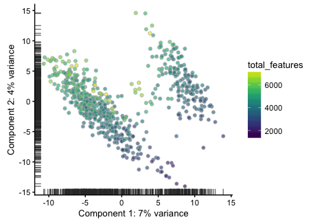
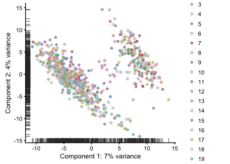
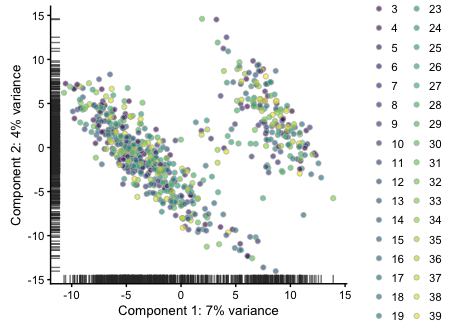
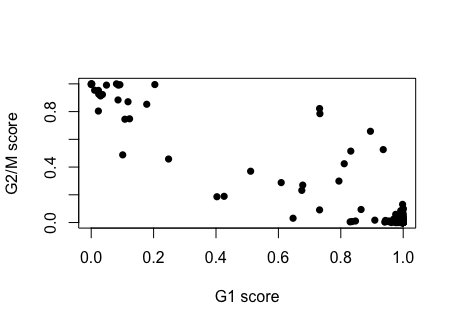
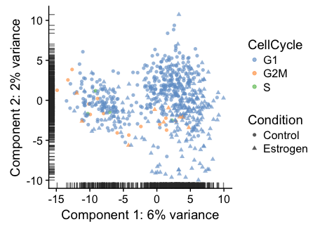
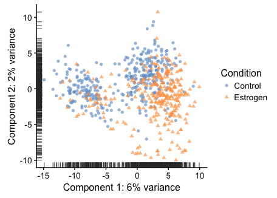
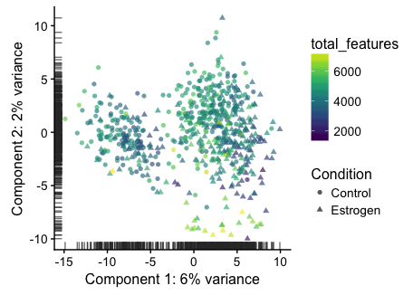
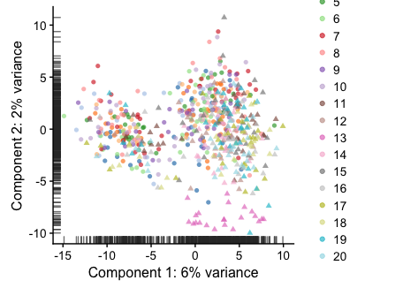

scRNA-Seq Anlaysis - 03 - Normalization
================

-   [Dependencies](#dependencies)
-   [Load the data](#load-the-data)
-   [Normalization using size factors](#normalization-using-size-factors)
    -   [Calculate size factors](#calculate-size-factors)
    -   [Normalize](#normalize)
-   [Assess confounding variables](#assess-confounding-variables)
    -   [Normalizing out IFC.Column](#normalizing-out-ifc.column)
    -   [Total\_features and IFC.Row](#total_features-and-ifc.row)
    -   [Cell Cycle Classification](#cell-cycle-classification)
-   [Re-assessing structure](#re-assessing-structure)
-   [Save point](#save-point)

Dependencies
============

``` r
library(scater)
```

    ## Loading required package: Biobase

    ## Loading required package: BiocGenerics

    ## Loading required package: parallel

    ## 
    ## Attaching package: 'BiocGenerics'

    ## The following objects are masked from 'package:parallel':
    ## 
    ##     clusterApply, clusterApplyLB, clusterCall, clusterEvalQ,
    ##     clusterExport, clusterMap, parApply, parCapply, parLapply,
    ##     parLapplyLB, parRapply, parSapply, parSapplyLB

    ## The following objects are masked from 'package:stats':
    ## 
    ##     IQR, mad, sd, var, xtabs

    ## The following objects are masked from 'package:base':
    ## 
    ##     anyDuplicated, append, as.data.frame, cbind, colMeans,
    ##     colnames, colSums, do.call, duplicated, eval, evalq, Filter,
    ##     Find, get, grep, grepl, intersect, is.unsorted, lapply,
    ##     lengths, Map, mapply, match, mget, order, paste, pmax,
    ##     pmax.int, pmin, pmin.int, Position, rank, rbind, Reduce,
    ##     rowMeans, rownames, rowSums, sapply, setdiff, sort, table,
    ##     tapply, union, unique, unsplit, which, which.max, which.min

    ## Welcome to Bioconductor
    ## 
    ##     Vignettes contain introductory material; view with
    ##     'browseVignettes()'. To cite Bioconductor, see
    ##     'citation("Biobase")', and for packages 'citation("pkgname")'.

    ## Loading required package: ggplot2

    ## Loading required package: SingleCellExperiment

    ## Loading required package: SummarizedExperiment

    ## Loading required package: GenomicRanges

    ## Loading required package: stats4

    ## Loading required package: S4Vectors

    ## 
    ## Attaching package: 'S4Vectors'

    ## The following object is masked from 'package:base':
    ## 
    ##     expand.grid

    ## Loading required package: IRanges

    ## Loading required package: GenomeInfoDb

    ## Loading required package: DelayedArray

    ## Loading required package: matrixStats

    ## 
    ## Attaching package: 'matrixStats'

    ## The following objects are masked from 'package:Biobase':
    ## 
    ##     anyMissing, rowMedians

    ## 
    ## Attaching package: 'DelayedArray'

    ## The following objects are masked from 'package:matrixStats':
    ## 
    ##     colMaxs, colMins, colRanges, rowMaxs, rowMins, rowRanges

    ## The following object is masked from 'package:base':
    ## 
    ##     apply

    ## 
    ## Attaching package: 'scater'

    ## The following object is masked from 'package:S4Vectors':
    ## 
    ##     rename

    ## The following object is masked from 'package:stats':
    ## 
    ##     filter

``` r
library(scran)
```

    ## Loading required package: BiocParallel

``` r
library(limma)
```

    ## 
    ## Attaching package: 'limma'

    ## The following object is masked from 'package:scater':
    ## 
    ##     plotMDS

    ## The following object is masked from 'package:BiocGenerics':
    ## 
    ##     plotMA

Load the data
=============

``` r
sce <- readRDS("../output/sce.filtered.rds")
```

Normalization using size factors
================================

We'll use the approach by Aaron Lun, implemented in scran, which deconvolutes pooled size factors.

Calculate size factors
----------------------

First we'll do a quick cluster so that the pooled cells are related

``` r
qclust <- scran::quickCluster(sce, min.size=30, assay.type="logcounts")
sce <- computeSumFactors(sce, sizes=30, clusters=qclust, assay.type="logcounts") #sizes must be > 2x smallest cluster
summary(sizeFactors(sce))
```

    ##    Min. 1st Qu.  Median    Mean 3rd Qu.    Max. 
    ##  0.1726  0.8359  0.9954  1.0000  1.1766  2.1129

``` r
plot(sizeFactors(sce), sce$total_counts/1e3, log="xy", pch=20,
     ylab="Library size (thousands)", xlab="Size factor", main="")
```



Normalize
---------

``` r
sce <- normalize(sce, exprs_values="counts")
```

Assess confounding variables
============================

``` r
plotPCA(sce, exprs_values="logcounts", colour_by="Condition")
```



``` r
plotPCA(sce, exprs_values="logcounts", colour_by="total_features")
```



``` r
plotPCA(sce, exprs_values="logcounts", colour_by="IFC.Column")
```



``` r
plotPCA(sce, exprs_values="logcounts", colour_by="IFC.Row")
```



There's a clear effect from total\_features, as well as some IFC column batch effects. We can normalize these effects out.

Normalizing out IFC.Column
--------------------------

I want to remove this first because it's kind of annoying to deal with because control cells are IFC.Column 1-10 and E2 cells are 11-20, so if you normalize out the effect of all IFC columns together, you remove out condition effects. To deal with this, I'll deal with each condition separately, then merge together the the normalized values

``` r
sce.control <- scater::filter(sce, Condition=="Control")
sce.control$IFC.Column <- factor(sce.control$IFC.Column,
                                 levels=unique(sce.control$IFC.Column))
exp.control.rm <- removeBatchEffect(logcounts(sce.control),
                                    batch=sce.control$IFC.Column)
                                 
                                 
sce.estrogen <- scater::filter(sce, Condition=="Estrogen")
sce.estrogen$IFC.Column <- factor(sce.estrogen$IFC.Column,
                                         levels=unique(sce.estrogen$IFC.Column))
exp.estrogen.rm <- removeBatchEffect(logcounts(sce.estrogen),
                                    batch=sce.estrogen$IFC.Column)

exp <- cbind(exp.control.rm, exp.estrogen.rm)
#Some values <0. These values are typically lowly expressed genes, so it's usually safe to set them to 0
exp[exp<0] <- 0
assay(sce, "exprs.ifc.rm") <- exp
```

Total\_features and IFC.Row
---------------------------

``` r
exp.removed <- removeBatchEffect(exp,
                                 batch=sce$IFC.Row,
                                 covariates=sce$total_features,
                                 design=model.matrix(~sce$Condition))
#Once again some <0 values arise
exp.removed[exp.removed<0] <- 0
assay(sce, "exprs.norm") <- exp.removed
```

Cell Cycle Classification
-------------------------

Just to see if cell cycle is driving any of the structure, we'll classify cells based on their expression of cell cycle markers. For this, we'll use cyclone, which is implemented in the scran pacage.

``` r
mm.pairs <- readRDS(system.file("exdata", "mouse_cycle_markers.rds", package="scran"))
assignments <- cyclone(sce, mm.pairs, gene.names=rownames(sce))
plot(assignments$score$G1, assignments$score$G2M, xlab="G1 score", ylab="G2/M score", pch=16)
```



``` r
data.frame(G1=sum(assignments$phases=="G1"), G2M=sum(assignments$phases=="G2M"),
           S=sum(assignments$phases=="S"))
```

    ##    G1 G2M S
    ## 1 613  23 4

Adding the assignments to colData

``` r
sce$CellCycle <- assignments$phases
plotPCA(sce, exprs_values="exprs.norm", colour_by="CellCycle", shape_by="Condition",
        theme_size=14)
```



Re-assessing structure
======================

``` r
plotPCA(sce, exprs_values="exprs.norm", shape_by="Condition", 
        colour_by="Condition", theme_size=12)
```



``` r
plotPCA(sce, exprs_values="exprs.norm", shape_by="Condition",
        colour_by="total_features", theme_size=12)
```



``` r
plotPCA(sce, exprs_values="exprs.norm", shape_by="Condition", 
        colour_by="IFC.Column", theme_size=12)
```



Save point
==========

``` r
saveRDS(sce, file="../output/sce.normalized.rds")
```
