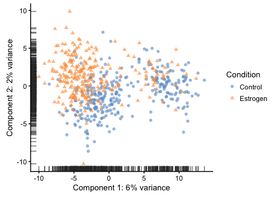
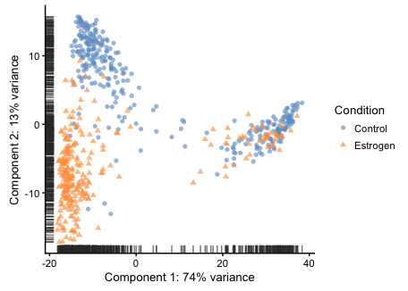
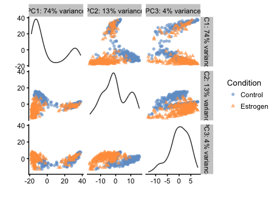

scRNA-Seq Anlaysis - 04 - Imputation
================

-   [Dependencies](#dependencies)
-   [Imputation](#imputation)
-   [Loading imputed data back in](#loading-imputed-data-back-in)
-   [Assessing the imputation](#assessing-the-imputation)
-   [Save point](#save-point)

Dependencies
============

``` r
library(scater)
```

    ## Loading required package: Biobase

    ## Loading required package: BiocGenerics

    ## Loading required package: parallel

    ## 
    ## Attaching package: 'BiocGenerics'

    ## The following objects are masked from 'package:parallel':
    ## 
    ##     clusterApply, clusterApplyLB, clusterCall, clusterEvalQ,
    ##     clusterExport, clusterMap, parApply, parCapply, parLapply,
    ##     parLapplyLB, parRapply, parSapply, parSapplyLB

    ## The following objects are masked from 'package:stats':
    ## 
    ##     IQR, mad, sd, var, xtabs

    ## The following objects are masked from 'package:base':
    ## 
    ##     anyDuplicated, append, as.data.frame, cbind, colMeans,
    ##     colnames, colSums, do.call, duplicated, eval, evalq, Filter,
    ##     Find, get, grep, grepl, intersect, is.unsorted, lapply,
    ##     lengths, Map, mapply, match, mget, order, paste, pmax,
    ##     pmax.int, pmin, pmin.int, Position, rank, rbind, Reduce,
    ##     rowMeans, rownames, rowSums, sapply, setdiff, sort, table,
    ##     tapply, union, unique, unsplit, which, which.max, which.min

    ## Welcome to Bioconductor
    ## 
    ##     Vignettes contain introductory material; view with
    ##     'browseVignettes()'. To cite Bioconductor, see
    ##     'citation("Biobase")', and for packages 'citation("pkgname")'.

    ## Loading required package: ggplot2

    ## Loading required package: SingleCellExperiment

    ## Loading required package: SummarizedExperiment

    ## Loading required package: GenomicRanges

    ## Loading required package: stats4

    ## Loading required package: S4Vectors

    ## 
    ## Attaching package: 'S4Vectors'

    ## The following object is masked from 'package:base':
    ## 
    ##     expand.grid

    ## Loading required package: IRanges

    ## Loading required package: GenomeInfoDb

    ## Loading required package: DelayedArray

    ## Loading required package: matrixStats

    ## 
    ## Attaching package: 'matrixStats'

    ## The following objects are masked from 'package:Biobase':
    ## 
    ##     anyMissing, rowMedians

    ## 
    ## Attaching package: 'DelayedArray'

    ## The following objects are masked from 'package:matrixStats':
    ## 
    ##     colMaxs, colMins, colRanges, rowMaxs, rowMins, rowRanges

    ## The following object is masked from 'package:base':
    ## 
    ##     apply

    ## 
    ## Attaching package: 'scater'

    ## The following object is masked from 'package:S4Vectors':
    ## 
    ##     rename

    ## The following object is masked from 'package:stats':
    ## 
    ##     filter

Imputation
==========

Here we'll use MAGIC (Van Dijk, BioRxiv, 2017) to smooth the data and restore some of the structure in the data that's lost to drop-out and other sources of technical variation.

The most developed implementation of MAGIC right now is in python, so I'll move the data over there and then bring it back into R.

Note: After running it on exprs.norm in it's current state, cell cycle started to affect things. Given the small number of proliferating cells, I'll just eliminate S/G2M cells from downstream analysis. Also, IFC column 13 really stands out as an outlier (even in current exprs.norm), so I'll get rid of them too.

``` r
sce <- readRDS("../output/sce.normalized.rds")
sce <- scater::filter(sce, CellCycle=="G1")
sce <- scater::filter(sce, IFC.Column!=13)
write.csv(t(assay(sce, "exprs.norm")), file="../output/exprs.norm.before.imputation.csv", quote=F, row.names=T)
```

Jump over to 04-imputation-magic.ipynb for the MAGIC script.

Loading imputed data back in
============================

``` r
magic <- read.csv("../output/exprs.norm.after.imputation.csv", row.names=1)
colnames(magic) <- rownames(sce)
assay(sce, "exprs.magic") <- t(as.matrix(magic))
```

Assessing the imputation
========================

``` r
plotPCA(sce, exprs_values="exprs.norm", shape_by="Condition", 
        colour_by="Condition")
```



``` r
plotPCA(sce, exprs_values="exprs.magic", shape_by="Condition", 
        colour_by="Condition")
```



Imputation really seems to bring out the divergence in the transcriptional manifolds between the two conditions.

``` r
plotPCA(sce, exprs_values="exprs.magic", shape_by="Condition", 
        colour_by="Condition", ncomponents=3)
```



Save point
==========

``` r
saveRDS(sce, file="../output/sce.normalized.imputed.rds")
```
