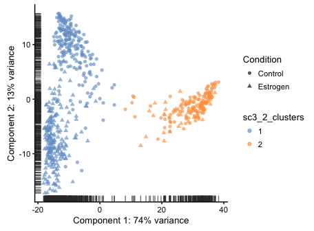
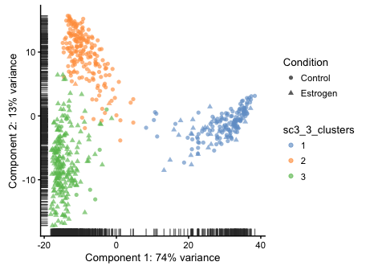
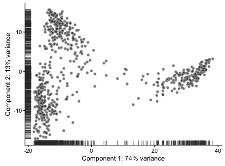
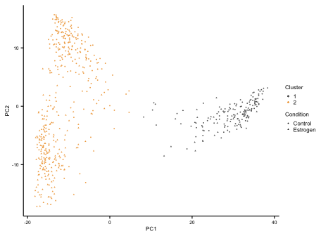
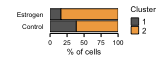
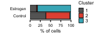
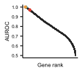
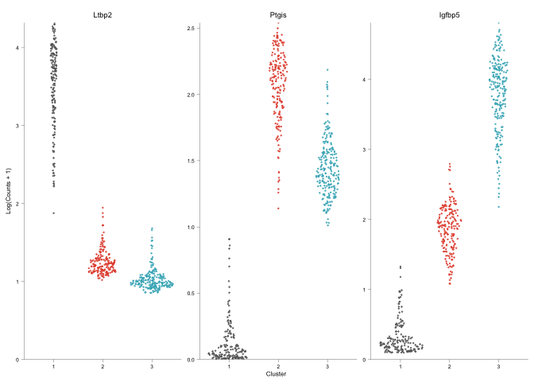

scRNA-Seq Anlaysis - 05 - Clustering
================

# Dependencies

``` r
library(scater)
```

    ## Loading required package: Biobase

    ## Loading required package: BiocGenerics

    ## Loading required package: parallel

    ## 
    ## Attaching package: 'BiocGenerics'

    ## The following objects are masked from 'package:parallel':
    ## 
    ##     clusterApply, clusterApplyLB, clusterCall, clusterEvalQ,
    ##     clusterExport, clusterMap, parApply, parCapply, parLapply,
    ##     parLapplyLB, parRapply, parSapply, parSapplyLB

    ## The following objects are masked from 'package:stats':
    ## 
    ##     IQR, mad, sd, var, xtabs

    ## The following objects are masked from 'package:base':
    ## 
    ##     anyDuplicated, append, as.data.frame, cbind, colMeans,
    ##     colnames, colSums, do.call, duplicated, eval, evalq, Filter,
    ##     Find, get, grep, grepl, intersect, is.unsorted, lapply,
    ##     lengths, Map, mapply, match, mget, order, paste, pmax,
    ##     pmax.int, pmin, pmin.int, Position, rank, rbind, Reduce,
    ##     rowMeans, rownames, rowSums, sapply, setdiff, sort, table,
    ##     tapply, union, unique, unsplit, which, which.max, which.min

    ## Welcome to Bioconductor
    ## 
    ##     Vignettes contain introductory material; view with
    ##     'browseVignettes()'. To cite Bioconductor, see
    ##     'citation("Biobase")', and for packages 'citation("pkgname")'.

    ## Loading required package: ggplot2

    ## Loading required package: SingleCellExperiment

    ## Loading required package: SummarizedExperiment

    ## Loading required package: GenomicRanges

    ## Loading required package: stats4

    ## Loading required package: S4Vectors

    ## 
    ## Attaching package: 'S4Vectors'

    ## The following object is masked from 'package:base':
    ## 
    ##     expand.grid

    ## Loading required package: IRanges

    ## Loading required package: GenomeInfoDb

    ## Loading required package: DelayedArray

    ## Loading required package: matrixStats

    ## 
    ## Attaching package: 'matrixStats'

    ## The following objects are masked from 'package:Biobase':
    ## 
    ##     anyMissing, rowMedians

    ## 
    ## Attaching package: 'DelayedArray'

    ## The following objects are masked from 'package:matrixStats':
    ## 
    ##     colMaxs, colMins, colRanges, rowMaxs, rowMins, rowRanges

    ## The following object is masked from 'package:base':
    ## 
    ##     apply

    ## 
    ## Attaching package: 'scater'

    ## The following object is masked from 'package:S4Vectors':
    ## 
    ##     rename

    ## The following object is masked from 'package:stats':
    ## 
    ##     filter

``` r
library(SC3)
library(dplyr)
```

    ## 
    ## Attaching package: 'dplyr'

    ## The following objects are masked from 'package:scater':
    ## 
    ##     arrange, filter, mutate, rename

    ## The following object is masked from 'package:matrixStats':
    ## 
    ##     count

    ## The following objects are masked from 'package:GenomicRanges':
    ## 
    ##     intersect, setdiff, union

    ## The following object is masked from 'package:GenomeInfoDb':
    ## 
    ##     intersect

    ## The following objects are masked from 'package:IRanges':
    ## 
    ##     collapse, desc, intersect, setdiff, slice, union

    ## The following objects are masked from 'package:S4Vectors':
    ## 
    ##     first, intersect, rename, setdiff, setequal, union

    ## The following object is masked from 'package:Biobase':
    ## 
    ##     combine

    ## The following objects are masked from 'package:BiocGenerics':
    ## 
    ##     combine, intersect, setdiff, union

    ## The following objects are masked from 'package:stats':
    ## 
    ##     filter, lag

    ## The following objects are masked from 'package:base':
    ## 
    ##     intersect, setdiff, setequal, union

``` r
library(tidyr)
```

    ## 
    ## Attaching package: 'tidyr'

    ## The following object is masked from 'package:S4Vectors':
    ## 
    ##     expand

``` r
library(ggforce)
```

# Load the data

``` r
sce <- readRDS("../output/sce.normalized.imputed.rds")
```

# Clustering with SC3

## Estimating optimal k

``` r
sce.temp <- sce
exprs(sce.temp) <- assay(sce.temp, "exprs.magic")
sce.temp <- sc3_estimate_k(sce.temp)
```

    ## Estimating k...

``` r
metadata(sce.temp)
```

    ## $log.exprs.offset
    ## [1] 1
    ## 
    ## $sc3
    ## $sc3$k_estimation
    ## [1] 3

Looks like optimal k for clustering is
3.

## Clustering

``` r
rowData(sce.temp)$feature_symbol <- rownames(sce.temp) # I should actually make this symbols
sce.temp <- sc3(sce.temp, ks=2:3, biology=TRUE, rand_seed=100)
```

    ## Setting SC3 parameters...

    ## Calculating distances between the cells...

    ## Performing transformations and calculating eigenvectors...

    ## Performing k-means clustering...

    ## Calculating consensus matrix...

    ## Calculating biology...

Bringing the results back to the main sce

``` r
colData(sce) <- colData(sce.temp)
rowData(sce) <- rowData(sce.temp)
```

# Assessing Clustersing

## PCA

``` r
plotPCA(sce, exprs_values="exprs.magic", shape_by="Condition",
        colour_by="sc3_2_clusters")
```

<!-- -->

``` r
plotPCA(sce, exprs_values="exprs.magic", shape_by="Condition",
        colour_by="sc3_3_clusters")
```

<!-- -->

### Figure

``` r
cols <- c("#44B3C2", "#F1A94E", "#E45641", "#5D4C46", "#7B8D8E", "#F2EDD8")
sce <- plotPCA(sce, exprs_values="exprs.magic", return_SCE=T)
```

<!-- -->

``` r
pca <- as.data.frame(sce@reducedDims$PCA[,1:2])
pca$Condition <- factor(sce$Condition)
pca$Cluster <- factor(sce$sc3_3_clusters)

#3 clusters
pca.3clust <- ggplot(pca, aes(x=PC1, y=PC2)) +
  geom_point(size=0.3, aes(colour=Cluster, shape=Condition)) +
  xlab("PC1") + ylab("PC2") +
  scale_color_manual(values=c("grey40", cols[3], cols[1])) +
  theme_classic() +
  theme(axis.text = element_text(size=5, color="black"),
        axis.title.x = element_text(size=6, color="black", 
                                    margin=unit(c(1,0,0,0), "mm")),
        axis.title.y = element_text(size=6, color="black", 
                                    margin=unit(c(0,1,0,0), "mm")),
        axis.line = element_line(size=0.4, color="black"),
        axis.ticks = element_line(size=0.4, color="black"),
        legend.text = element_text(size=6),
        legend.title = element_text(size=6),
        legend.key.size = unit(0.45, 'lines'),
        legend.margin=margin(c(-4,0,0,-5), "mm"),
        plot.background=element_rect(fill="transparent", colour=NA))
```

    ## Warning in unit(c(t, r, b, l), unit): NAs introduced by coercion

``` r
pca.3clust
```

<!-- -->

``` r
ggsave(pca.3clust, file="../figs/pca.3clust.pdf", width=1.9, height=1.215,
       useDingbats=F)

#2 clusters
pca$Cluster <- as.numeric(sce$sc3_2_clusters)
pca$Cluster[pca$Cluster==1] <- 3 #Stupid round-about way to swap cluster IDs
pca$Cluster[pca$Cluster==2] <- 1
pca$Cluster[pca$Cluster==3] <- 2
pca$Cluster <- factor(pca$Cluster)
pca.2clust <- ggplot(pca, aes(x=PC1, y=PC2)) +
  geom_point(size=0.3, aes(colour=Cluster, shape=Condition)) +
  xlab("PC1") + ylab("PC2") +
  scale_color_manual(values=c("grey40", cols[2])) +
  theme_classic() +
  theme(axis.text = element_text(size=5, color="black"),
        axis.title.x = element_text(size=6, color="black", 
                                    margin=unit(c(1,0,0,0), "mm")),
        axis.title.y = element_text(size=6, color="black", 
                                    margin=unit(c(0,1,0,0), "mm")),
        axis.line = element_line(size=0.4, color="black"),
        axis.ticks = element_line(size=0.4, color="black"),
        legend.text = element_text(size=6),
        legend.title = element_text(size=6),
        legend.key.size = unit(0.45, 'lines'),
        legend.margin=margin(c(-4,0,0,-5), "mm"),
        plot.background=element_rect(fill="transparent", colour=NA))
```

    ## Warning in unit(c(t, r, b, l), unit): NAs introduced by coercion

``` r
pca.2clust
```

<!-- -->

``` r
ggsave(pca.2clust, file="../figs/pca.2clust.pdf", width=1.9, height=1.215,
       useDingbats=F)
```

# Proportions of each condition in each cluster

Two clusters splits the left-right clustering pattern apart, and three
clusters seems to split the left cluster near-perfectly by condition.
Let’s make some plots to just see the proportions.

``` r
clust2.prop <- as.data.frame(colData(sce)) %>%
  group_by(Condition, sc3_2_clusters) %>%
  dplyr::summarize(count = n()) %>%
  mutate(freq = (count / sum(count)) * 100)
clust2.prop$sc3_2_clusters <- as.numeric(clust2.prop$sc3_2_clusters)
clust2.prop$sc3_2_clusters[clust2.prop$sc3_2_clusters==1] <- 3 #Same stupid hack
clust2.prop$sc3_2_clusters[clust2.prop$sc3_2_clusters==2] <- 1
clust2.prop$sc3_2_clusters[clust2.prop$sc3_2_clusters==3] <- 2
clust2.prop$sc3_2_clusters <- factor(clust2.prop$sc3_2_clusters)
clust2 <- ggplot(clust2.prop, aes(x=Condition, y=freq, 
                                  fill=factor(sc3_2_clusters))) +
  geom_bar(color="black", stat="identity", size=0.3,
           position=position_stack(reverse=T)) +
  xlab("") + ylab("% of cells") +
  scale_y_continuous(limits=c(0,100), expand=c(0,0)) +
  scale_fill_manual(values=c("grey40", cols[2]), name="Cluster") +
  theme_classic() +
  theme(axis.text = element_text(size=5, color="black"),
        axis.title.x = element_text(size=6, color="black", 
                                    margin=unit(c(1,0,0,0), "mm")),
        axis.title.y = element_text(size=6, color="black", 
                                    margin=unit(c(0,1,0,0), "mm")),
        axis.line.x = element_line(size=0.4, color="black"),
        axis.line.y = element_blank(),
        axis.ticks.x = element_line(size=0.4, color="black"),
        axis.ticks.y = element_blank(),
        legend.text = element_text(size=6),
        legend.title = element_text(size=6),
        legend.key.size = unit(0.45, 'lines'),
        legend.margin=margin(c(0,0,0,-2), "mm"),
        plot.background=element_rect(fill="transparent", colour=NA)) +
  coord_flip()
```

    ## Warning in unit(c(t, r, b, l), unit): NAs introduced by coercion

``` r
clust2
```

<!-- -->

``` r
ggsave(clust2, file="../figs/clusters.2.proportions.pdf", width=1.7, height=0.65,
       useDingbats=F)
```

\#\#\#Three clusters

``` r
clust3.prop <- as.data.frame(colData(sce)) %>%
  group_by(Condition, sc3_3_clusters) %>%
  dplyr::summarize(count = n()) %>%
  mutate(freq = (count / sum(count)) * 100)
clust3 <- ggplot(clust3.prop, aes(x=Condition, y=freq, 
                                  fill=factor(sc3_3_clusters))) +
  geom_bar(color="black", stat="identity", size=0.3,
           position=position_stack(reverse=T)) +
  xlab("") + ylab("% of cells") +
  scale_y_continuous(limits=c(0,100), expand=c(0,0)) +
  scale_fill_manual(values=c("grey40", cols[3], cols[1]), name="Cluster") +
  theme_classic() +
  theme(axis.text = element_text(size=5, color="black"),
        axis.title.x = element_text(size=6, color="black", 
                                    margin=unit(c(1,0,0,0), "mm")),
        axis.title.y = element_text(size=6, color="black", 
                                    margin=unit(c(0,1,0,0), "mm")),
        axis.line.x = element_line(size=0.4, color="black"),
        axis.line.y = element_blank(),
        axis.ticks.x = element_line(size=0.4, color="black"),
        axis.ticks.y = element_blank(),
        legend.text = element_text(size=6),
        legend.title = element_text(size=6),
        legend.key.size = unit(0.45, 'lines'),
        legend.margin=margin(c(0,0,0,-2), "mm"),
        plot.background=element_rect(fill="transparent", colour=NA)) +
  coord_flip()
```

    ## Warning in unit(c(t, r, b, l), unit): NAs introduced by coercion

``` r
clust3
```

<!-- -->

``` r
ggsave(clust3, file="../figs/clusters.3.proportions.pdf", width=1.7, height=0.65,
       useDingbats=F)
```

\#Cluster markers SC3 uses an AUROC approach to define unique markers of
each cluster

``` r
auroc <- data.frame(auroc=rowData(sce)$sc3_3_markers_auroc,
                    gene=rownames(sce),
                    cluster=rowData(sce)$sc3_3_markers_clusts)
auroc <- auroc[order(auroc$auroc),]
auroc <- na.omit(auroc)
auroc$rank <- nrow(auroc):1
rownames(auroc) <- auroc$gene
auroc$size <- 1
auroc$color <- "a"
auroc["ENSMUSG00000002020",]$size <- 2 #Ltbp2
auroc["ENSMUSG00000002020",]$color <- "b" #Ltbp2
auroc["ENSMUSG00000017969",]$size <- 2 #Ptgis
auroc["ENSMUSG00000017969",]$color <- "c" #Ptgis
auroc["ENSMUSG00000026185",]$size <- 2 #Igfbp5
auroc["ENSMUSG00000026185",]$color <- "d" #Igfbp5

auroc.plot <- ggplot(auroc, aes(x=rank, y=auroc)) +
  geom_point(data=auroc[which(auroc$size != 2),], size=0.01, aes(color=color)) +
  geom_point(data=auroc[which(auroc$size == 2),], size=1, aes(color=color)) +
  scale_color_manual(values=c("grey20", cols[2], cols[3], cols[1])) +
  xlab("Gene rank") + ylab("AUROC") +
  theme_classic() +
  theme(legend.position="none",
        axis.text.y = element_text(size=5, color="black"),
        axis.text.x = element_blank(),
        axis.title.x = element_text(size=6, color="black", 
                                    margin=unit(c(1,0,0,0), "mm")),
        axis.title.y = element_text(size=6, color="black", 
                                    margin=unit(c(0,1,0,0), "mm")),
        axis.line = element_line(size=0.4, color="black"),
        axis.ticks.y = element_line(size=0.4, color="black"),
        axis.ticks.x = element_blank(),
        plot.background=element_rect(fill="transparent", colour=NA))
auroc.plot
```

<!-- -->

``` r
ggsave(auroc.plot, file="../figs/auroc.plot.pdf", width=1.25, height=1.1,
       useDingbats=F)
```

## Marker expression across clusters

``` r
marker.exp <- data.frame(ltbp2 = assay(sce,
                                       "exprs.magic")["ENSMUSG00000002020",],
                         ptgis = assay(sce,
                                       "exprs.magic")["ENSMUSG00000017969",],
                         igfbp5 = assay(sce,
                                       "exprs.magic")["ENSMUSG00000026185",],
                         cluster = sce$sc3_3_clusters)

marker.exp <- gather(marker.exp, "gene", "expression", -cluster)
marker.exp$gene <- factor(marker.exp$gene, levels=c("ltbp2", "ptgis", "igfbp5"))
labels <- c(ltbp2="Ltbp2", ptgis="Ptgis", igfbp5="Igfbp5")

marker.plot <- ggplot(marker.exp, aes(x=factor(cluster), y=expression)) +
  geom_sina(size=0.1, alpha=0.75, aes(colour=factor(cluster))) +
  facet_wrap(~gene, scales="free_y", labeller=labeller(gene=labels)) +
  scale_colour_manual(values=c("grey40", cols[3], cols[1])) +
  scale_y_continuous(expand=c(0,0), limits=c(0,NA)) +
  xlab("Cluster") + ylab("Log(Counts + 1)") +
  theme_classic() +
  theme(axis.title=element_text(size=5),
        axis.text=element_text(size=5, color="black"),
        axis.ticks=element_line(color="black", size=0.1),
        axis.line=element_line(color="black", size=0.1),
        axis.title.x = element_text(size=6, color="black", 
                                    margin=unit(c(1,0,0,0), "mm")),
        axis.title.y = element_text(size=6, color="black", 
                                    margin=unit(c(0,1,0,0), "mm")),
        strip.background=element_blank(),
        strip.text=element_text(size=7, color="black", margin=unit(c(0,0,0,0), "mm")),
        legend.position="none")
marker.plot
```

<!-- -->

``` r
ggsave(marker.plot, file="../figs/marker.plot.pdf", width=3.4, height=1.3)
```

\#Save Point

``` r
saveRDS(sce, file="../output/sce.clustered.rds")
```
